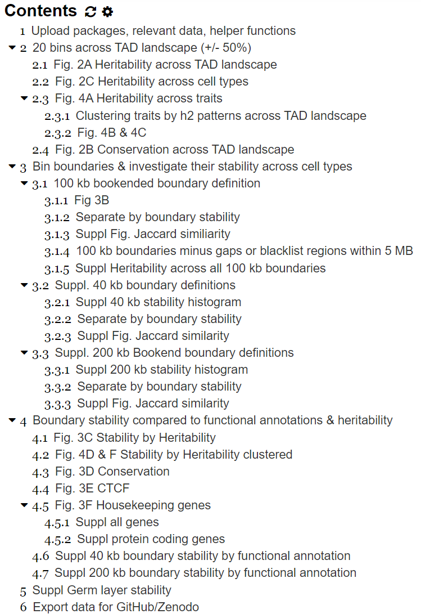

# README for data in paper

Created: Oct 23, 2020 4:16 PM
Last Edited: Oct 29, 2020 12:33 PM

### Authors

Evonne McArthur & Tony Capra @ the [Capra Lab](http://www.capralab.org/) 

### Paper

Topologically associating domain (TAD) boundaries stable across diverse cell types are evolutionarily constrained and enriched for heritability

Currently at: [https://www.biorxiv.org/content/10.1101/2020.01.10.901967v2](https://www.biorxiv.org/content/10.1101/2020.01.10.901967v2)

### Code

`TAD-heritability-stability.ipynb`

To run, see the list/build of packages used in the environment (`env.yml`). You can install this through an [Anaconda environment](https://docs.conda.io/projects/conda/en/latest/user-guide/tasks/manage-environments.html#creating-an-environment-from-an-environment-yml-file) or manually. The main packages needed include numpy, pandas, matlpotlib, scipy, statsmodel (not all those in `env.yml` are used).

**List of code table of contents:**

### Publicly available data & software

The publicly available datasets and software used for analysis are available in the following repositories: TAD maps from 3D Genome Browser [[https://promoter.bx.psu.edu/hi-c/publications.html](https://promoter.bx.psu.edu/hi-c/publications.html)], information regarding the cell types from ENCODE [[http://genome.ucsc.edu/ENCODE/cellTypes.html](http://genome.ucsc.edu/ENCODE/cellTypes.html)], LDSC [[https://github.com/bulik/ldsc](https://github.com/bulik/ldsc)], GWAS traits formatted for LDSC from the Alkes Price lab [[https://data.broadinstitute.org/alkesgroup/LDSCORE/independent_sumstats/](https://data.broadinstitute.org/alkesgroup/LDSCORE/independent_sumstats/)], housekeeping genes [[https://www.tau.ac.il/~elieis/HKG/HK_genes.txt](https://www.tau.ac.il/~elieis/HKG/HK_genes.txt)], PhastCons elements, RefSeq Genes, and genome gaps [[https://genome.ucsc.edu/cgi-bin/hgTables](https://genome.ucsc.edu/cgi-bin/hgTables)], and CTCF ChIP-seq peaks [[https://www.encodeproject.org/](https://www.encodeproject.org/)].

### Data

in the `./data` folder

- `3DGenomeBrowser.key`: List of cell context name and its corresponding location to the TAD calls,
downloaded from: 3d_genome_browser TAD coordinates generated from the Dixon 2012 paper pipeline ([http://promoter.bx.psu.edu/hi-c/publications.html](http://promoter.bx.psu.edu/hi-c/publications.html)). Change the file paths in the second column to point to your path for the 3D genome browser data.
- `gap_regions_hg19.bed`: Genome gap regions in hg19 from: [http://genome.ucsc.edu/cgi-bin/hgTables](http://genome.ucsc.edu/cgi-bin/hgTables) --> hg19 --> All Tables -> table:gap
- `blacklist_plus_gaps_hg19.bed`: Genomic gaps from `gap_regions_hg19.bed` and Human genome (hg19) black list regions from this paper: [https://www.nature.com/articles/s41598-019-45839-z](https://www.nature.com/articles/s41598-019-45839-z)
The ENCODE Blacklist: Identification of Problematic Regions of the Genome, Downloaded from the Boyle Lab Github: [https://github.com/Boyle-Lab/Blacklist/blob/master/lists/hg19-blacklist.v2.bed.gz](https://github.com/Boyle-Lab/Blacklist/blob/master/lists/hg19-blacklist.v2.bed.gz) (was last updated Nov 13 2018) - Downloaded Sept 12 2019
- folder `./data/boundariesByStability`: List of different boundary definitions grouped by their stability
    - folder: `100kbBookendBoundaries_mainText`
        - `100kbBookendBoundaries_byStability.bed`: Contains all 100 kb Bookend boundaries in bed format with the 4th column being the absolute number of cell contexts that boundary was found in and the 5th column being the percentile transformation of the counts column
        - `Q[1-4]of4_100kbBookendBoundaries_removeGaps.bed`: Contains all 100 kb Bookend boundaries in bed format separated by their quartile of stability. This is used as input for S-LDSC
    - folder: `40kbBoundaries_suppl`
        - Contains same set of bed boundary files described above
    - folder: `200kbBoundaries_suppl`
        - Contains same set of bed boundary files described above
    - folder: `germLayerStability_suppl`
        - `boundaries_100kbBookend_germLayerStability_[1-3].bed`: Contains bed files of the 100kb bookend boundaries stratified by their stability across germ layers for the germ-layer informed boundary stability supplemental figure
- folder `./data/20binsTADlandscape/[cell-type]`
    - Motivated by Krefting et al, we considered TADs plus 50% of their total length flanking on each side subdivided into 20 equal-sized partitions. Hence, the center 10 bins (6-15) are inside the TAD. Bins 1-5 are upstream of the TAD and 16-20 are downstream of the TAD. These are the partitioned bins per each cell type.
- folder `./data/partitioned_h2`: partitioned heritability results from S-LDSC for heritability enrichment values (`[result]_enrichment.tsv`), standard errors for the heritability enrichment (`[result]_stderr.tsv`), p value for the enrichment (`[result]_pval.tsv`), and tau* value (`[result]_tau.tsv`)
    - folder: `20binsTADlandscape/[cell_type]/`
        - heritability results across the 3D genome landscape per cell type for the 20 bins surrounding (+/- 50%) TADs
    - folder: `boundaryStability`
        - heritability results for different boundary stability definitions (100kb, 40kb, 200kb, germLayer-informed stability) and heritability results for 100kb boundaries that were not stratified by stability (`100kbBoundaries_noStabilityStrat_suppl`)
